## Hex Dump (Annotated)

```text
Offset | Data (Hex)                                      | ASCII (approx)
-------+-------------------------------------------------+---------------
000    | 060e0000 8076706a 00000000 00000000              | .....vpj........
016    | 00000000 00000000 00000000 00000000              | ................
032    | 81030000 9d000000 00000000 00000000              | ................
048    | 00000000 00000000 00000000 00000000              | ................
064    | e0000000 40010000 00000000 00000000              | ....@...........
080    | 00000000 00000000 00000000 00000000              | ................
096    | 146e616d 6500050d 00000053 69722042              | .name......Sir B
112    | 79746561 6c6f7400 186c6576 656c0002              | ytealot..level..
128    | 3c000000 00000000 2c686974 5f636861              | <.......,hit_cha
144    | 6e636500 03666666 666666ee 3f3c6973              | nce..ffffff.?<is
160    | 5f707670 5f656e61 626c6564 00010118              | _pvp_enabled....
176    | 6775696c 64000034 706f7274 72616974              | guild..4portrait
192    | 5f726177 00040400 0000cafe babe246e              | _raw..........$n
208    | 69636b6e 616d6500 05010000 00000000              | ickname.........
224    | 06080000 5ad1880f 3dbcda0f 144a6110              | ....Z...=....Ja.
240    | 1bec7010 2bec332e 96cf623d dd716954              | ..p.+.3...b=.qiT
256    | 07000000 af000000 78000000 8d020000              | ........x.......
272    | a0010000 88000000 b2010000 6c060000              | ............l...
288    | 00000000 00000000 00000000 00000000              | ................
304    | 00000000 00000000 00000000 00000000              | ................
320    | 06000000 460c9b7c cb9e5c81 03abde88              | ....F..|..\.....
336    | f36f69ac 8fff44af fcdce6e5 00000000              | .oi...D.........
352    | 06000000 60000000 ce000000 b7000000              | ....`...........
368    | cd040000 44040000 21020000 00000000              | ....D...!.......
384    | 00000000 00000000 00000000 00000000              | ................
400    | 00000000 00000000 00000000 00000000              | ................
416    | 2c637573 746f6d5f 74616700 04000000              | ,custom_tag.....
432    | 00003461 63746976 655f6275 66667300              | ..4active_buffs.
448    | 07000000 00000000 00000000 00000000              | ................
464    | 00000000 00000000 00000000 00000000              | ................
480    | 00000000 00000000 00000000 00000000              | ................
496    | 00000000 00000000 00000000 00000000              | ................
512    | 00000000 00000000 00000000 00000000              | ................
528    | 00000000 00000000 00000000 00000000              | ................
544    | 00287065 745f7374 61747300 06000000              | .(pet_stats.....
560    | 00000000 00000000 00000000 00000000              | ................
576    | 00000000 00000000 00000000 00000000              | ................
592    | 00000000 00000000 00000000 00000000              | ................
608    | 00000000 00000000 00000000 00000000              | ................
624    | 00000000 00000000 00000000 00000000              | ................
640    | 00000000 00000000 00000000 00187374              | ..............st
656    | 61747300 060a0000 3080880b 00000000              | ats.....0.......
672    | 00000000 00000000 00000000 00000000              | ................
688    | 00000000 81020000 10030000 00000000              | ................
704    | 00000000 00000000 00000000 00000000              | ................
720    | 00000000 58030000 b8030000 00000000              | ....X...........
736    | 00000000 00000000 00000000 00000000              | ................
752    | 00000000 10737472 00021200 00000000              | .....str........
768    | 00001064 65780002 0e000000 00000000              | ...dex..........
784    | 10696e74 00020a00 00000000 00001076              | .int...........v
800    | 69740002 10000000 00000000 10776973              | it...........wis
816    | 00020c00 00000000 00001063 68610002              | ...........cha..
832    | 08000000 00000000 10616769 00020d00              | .........agi....
848    | 00000000 00000000 06080000 365d880b              | ............6]..
864    | d165880b c669880b 1c6f880b 00000000              | .e...i...o......
880    | 00000000 00000000 04000000 48030000              | ............H...
896    | 3a030000 02030000 26040000 00000000              | :.......&.......
912    | 00000000 00000000 00000000 00000000              | ................
928    | 00000000 00000000 00000000 00000000              | ................
944    | 00000000 00000000 06000000 c98d880b              | ................
960    | cc9c880b 7eab880b d8b6880b 18bb880b              | ....~...........
976    | 00000000 00000000 05000000 18040000              | ................
992    | 34040000 f4020000 1e030000 2c030000              | 4...........,...
1008    | 00000000 00000000 00000000 00000000              | ................
1024    | 00000000 00000000 00000000 00000000              | ................
1040    | 00000000 00000000 106c7563 00020900              | .........luc....
1056    | 00000000 00001065 6e640002 0f000000              | .......end......
1072    | 00000000 10706572 00020b00 00000000              | .....per........
1088    | 00000000 2c737065 6c6c5f62 6f6f6b00              | ....,spell_book.
1104    | 07030000 00000000 01000000 02000000              | ................
1120    | 00000000 00000000 00000000 00000000              | ................
1136    | c3000000 b0040000 b9040000 c2040000              | ................
1152    | 00000000 00000000 00000000 00000000              | ................
1168    | 00000000 00000000 00000000 00000000              | ................
1184    | 00000000 00000000 00000000 00000000              | ................
1200    | 02650000 00000000 0002cd00 00000000              | .e..............
1216    | 0000022f 01000000 00000000 0028696e              | .../.........(in
1232    | 76656e74 6f727900 07020000 00000000              | ventory.........
1248    | 01000000 00000000 00000000 00000000              | ................
1264    | 00000000 00000000 82000000 38050000              | ............8...
1280    | d0050000 00000000 00000000 00000000              | ................
1296    | 00000000 00000000 00000000 00000000              | ................
1312    | 00000000 00000000 00000000 00000000              | ................
1328    | 00000000 00000000 06030000 bd6a880b              | .............j..
1344    | 460c9b7c 07bd9e7c 00000000 00000000              | F..|...|........
1360    | 00000000 00000000 c3000000 c1050000              | ................
1376    | aa050000 98050000 00000000 00000000              | ................
1392    | 00000000 00000000 00000000 00000000              | ................
1408    | 00000000 00000000 00000000 00000000              | ................
1424    | 00000000 00000000 14747970 65000507              | .........type...
1440    | 00000077 6561706f 6e00146e 616d6500              | ...weapon..name.
1456    | 050c0000 00527573 74792053 776f7264              | .....Rusty Sword
1472    | 0010646d 67000205 00000000 00000000              | ..dmg...........
1488    | 06030000 7fd1977c 460c9b7c 07bd9e7c              | .......|F..|...|
1504    | 00000000 00000000 00000000 00000000              | ................
1520    | c3000000 5c060000 42060000 30060000              | ....\...B...0...
1536    | 00000000 00000000 00000000 00000000              | ................
1552    | 00000000 00000000 00000000 00000000              | ................
1568    | 00000000 00000000 00000000 00000000              | ................
1584    | 14747970 65000507 00000070 6f74696f              | .type......potio
1600    | 6e00146e 616d6500 050f0000 00486561              | n..name......Hea
1616    | 6c696e67 20506f74 696f6e00 14686561              | ling Potion..hea
1632    | 6c000232 00000000 00000000 2c736176              | l..2........,sav
1648    | 655f706f 696e7400 07030000 00000000              | e_point.........
1664    | 01000000 02000000 00000000 00000000              | ................
1680    | 00000000 00000000 c3000000 d8060000              | ................
1696    | e9060000 f4060000 00000000 00000000              | ................
1712    | 00000000 00000000 00000000 00000000              | ................
1728    | 00000000 00000000 00000000 00000000              | ................
1744    | 00000000 00000000 050c0000 00446172              | .............Dar
1760    | 6b20466f 72657374 00022079 68670000              | k Forest.. yhg..
1776    | 00000000 06020000 1db60200 1eb60200              | ................
1792    | 00000000 00000000 00000000 00000000              | ................
1808    | 00000000 82000000 54070000 60070000              | ........T...`...
1824    | 00000000 00000000 00000000 00000000              | ................
1840    | 00000000 00000000 00000000 00000000              | ................
1856    | 00000000 00000000 00000000 00000000              | ................
1872    | 00000000 08780002 78000000 00000000              | .....x..x.......
1888    | 08790002 37000000 00000000                       | .y..7.......
```

## Detailed Breakdown

### Root Node (Offsets 0-96)

**Header Excerpt**: `060e00008076706a...`

#### Byte 0-4: GenType
Value: `0x00000e06`
*   **Type**: OBJECT
*   **Generation**: 14

#### Bytes 4-32: Hashes
Active Hashes: 0x6a707680

#### Bytes 32-36: SizeKc
Value: `0x00000381` (KeyCount: 1, Total Size: 14)

#### Bytes 36-64: KvOffsets
Pointers to Entries: 157

### Data Entry 1: "name" (Offset 96)
**Total Size**: 24 bytes
**Raw Data**: `14 6e 61 6d 65 00 05 0d 00 00 00 53 69 72 20 42 79 74 65 61 6c 6f 74 00`

| Offset | Bytes | Interpretation |
| :--- | :--- | :--- |
| **96** | `14` | **KeyTag**: Len 1. KeyLen 5 |
| **97** | `6e616d6500` | **Key**: "name" |
| **102** | `05` | **TypeTag**: STRING (5) |
| **107** | ... | **Value**: "Sir Bytealot" |

### Data Entry 2: "level" (Offset 120)
**Total Size**: 16 bytes
**Raw Data**: `18 6c 65 76 65 6c 00 02 3c 00 00 00 00 00 00 00`

| Offset | Bytes | Interpretation |
| :--- | :--- | :--- |
| **120** | `18` | **KeyTag**: Len 1. KeyLen 6 |
| **121** | `6c6576656c00` | **Key**: "level" |
| **127** | `02` | **TypeTag**: I64 (2) |
| **128** | ... | **Value**: 60 (I64) |

### Data Entry 3: "hit_chance" (Offset 136)
**Total Size**: 21 bytes
**Raw Data**: `2c 68 69 74 5f 63 68 61 6e 63 65 00 03 66 66 66 66 66 66 ee 3f`

| Offset | Bytes | Interpretation |
| :--- | :--- | :--- |
| **136** | `2c` | **KeyTag**: Len 1. KeyLen 11 |
| **137** | `6869745f6368616e636500` | **Key**: "hit_chance" |
| **148** | `03` | **TypeTag**: F64 (3) |
| **149** | ... | **Value**: 0.9500 (F64) |

### Data Entry 4: "is_pvp_enabled" (Offset 157)
**Total Size**: 18 bytes
**Raw Data**: `3c 69 73 5f 70 76 70 5f 65 6e 61 62 6c 65 64 00 01 01`

| Offset | Bytes | Interpretation |
| :--- | :--- | :--- |
| **157** | `3c` | **KeyTag**: Len 1. KeyLen 15 |
| **158** | `69735f7076705f656e61626c656400` | **Key**: "is_pvp_enabled" |
| **173** | `01` | **TypeTag**: BOOL (1) |
| **174** | `01` | **Value**: True |

### Data Entry 5: "guild" (Offset 175)
**Total Size**: 8 bytes
**Raw Data**: `18 67 75 69 6c 64 00 00`

| Offset | Bytes | Interpretation |
| :--- | :--- | :--- |
| **175** | `18` | **KeyTag**: Len 1. KeyLen 6 |
| **176** | `6775696c6400` | **Key**: "guild" |
| **182** | `00` | **TypeTag**: UNK (0) |

### Data Entry 6: "portrait_raw" (Offset 183)
**Total Size**: 23 bytes
**Raw Data**: `34 70 6f 72 74 72 61 69 74 5f 72 61 77 00 04 04 00 00 00 ca fe ba be`

| Offset | Bytes | Interpretation |
| :--- | :--- | :--- |
| **183** | `34` | **KeyTag**: Len 1. KeyLen 13 |
| **184** | `706f7274726169745f72617700` | **Key**: "portrait_raw" |
| **197** | `04` | **TypeTag**: BYTES (4) |

### Data Entry 7: "nickname" (Offset 206)
**Total Size**: 16 bytes
**Raw Data**: `24 6e 69 63 6b 6e 61 6d 65 00 05 01 00 00 00 00`

| Offset | Bytes | Interpretation |
| :--- | :--- | :--- |
| **206** | `24` | **KeyTag**: Len 1. KeyLen 9 |
| **207** | `6e69636b6e616d6500` | **Key**: "nickname" |
| **216** | `05` | **TypeTag**: STRING (5) |
| **221** | ... | **Value**: "" |

### Gap / Padding (Offsets 222-224)
*   2 bytes (0x2) likely alignment padding.

### Node 2 (Offsets 224-320)

**Header Excerpt**: `060800005ad1880f...`

#### Byte 0-4: GenType
Value: `0x00000806`
*   **Type**: OBJECT
*   **Generation**: 8

#### Bytes 4-32: Hashes
Active Hashes: 0xf88d15a, 0xfdabc3d, 0x10614a14, 0x1070ec1b, 0x2e33ec2b, 0x3d62cf96, 0x546971dd

#### Bytes 32-36: SizeKc
Value: `0x00000007` (KeyCount: 7, Total Size: 0)

#### Bytes 36-64: KvOffsets
Pointers to Entries: 175, 120, 653, 416, 136, 434, 1644

### Node 3 (Offsets 320-416)

**Header Excerpt**: `06000000460c9b7c...`

#### Byte 0-4: GenType
Value: `0x00000006`
*   **Type**: OBJECT
*   **Generation**: 0

#### Bytes 4-32: Hashes
Active Hashes: 0x7c9b0c46, 0x815c9ecb, 0x88deab03, 0xac696ff3, 0xaf44ff8f, 0xe5e6dcfc

#### Bytes 32-36: SizeKc
Value: `0x00000006` (KeyCount: 6, Total Size: 0)

#### Bytes 36-64: KvOffsets
Pointers to Entries: 96, 206, 183, 1229, 1092, 545

### Data Entry 8: "custom_tag" (Offset 416)
**Total Size**: 17 bytes
**Raw Data**: `2c 63 75 73 74 6f 6d 5f 74 61 67 00 04 00 00 00 00`

| Offset | Bytes | Interpretation |
| :--- | :--- | :--- |
| **416** | `2c` | **KeyTag**: Len 1. KeyLen 11 |
| **417** | `637573746f6d5f74616700` | **Key**: "custom_tag" |
| **428** | `04` | **TypeTag**: BYTES (4) |

### Gap / Padding (Offsets 433-434)
*   1 bytes (0x1) likely alignment padding.

### Data Entry 9: "active_buffs" (Offset 434)
**Total Size**: 14 bytes
**Raw Data**: `34 61 63 74 69 76 65 5f 62 75 66 66 73 00`

| Offset | Bytes | Interpretation |
| :--- | :--- | :--- |
| **434** | `34` | **KeyTag**: Len 1. KeyLen 13 |
| **435** | `6163746976655f627566667300` | **Key**: "active_buffs" |
| **448** | `07` | **TypeTag**: ARRAY (7) |
| ... | ... | *Inline Node follows immediately...* |

### Node 4 (Offsets 448-544)

**Header Excerpt**: `0700000000000000...`

#### Byte 0-4: GenType
Value: `0x00000007`
*   **Type**: ARRAY
*   **Generation**: 0

#### Bytes 4-32: Hashes
Active Hashes: 

#### Bytes 32-36: SizeKc
Value: `0x00000000` (KeyCount: 0, Total Size: 0)

#### Bytes 36-64: KvOffsets
Pointers to Entries: 

### Gap / Padding (Offsets 544-545)
*   1 bytes (0x1) likely alignment padding.

### Data Entry 10: "pet_stats" (Offset 545)
**Total Size**: 11 bytes
**Raw Data**: `28 70 65 74 5f 73 74 61 74 73 00`

| Offset | Bytes | Interpretation |
| :--- | :--- | :--- |
| **545** | `28` | **KeyTag**: Len 1. KeyLen 10 |
| **546** | `7065745f737461747300` | **Key**: "pet_stats" |
| **556** | `06` | **TypeTag**: OBJECT (6) |
| ... | ... | *Inline Node follows immediately...* |

### Node 5 (Offsets 556-652)

**Header Excerpt**: `0600000000000000...`

#### Byte 0-4: GenType
Value: `0x00000006`
*   **Type**: OBJECT
*   **Generation**: 0

#### Bytes 4-32: Hashes
Active Hashes: 

#### Bytes 32-36: SizeKc
Value: `0x00000000` (KeyCount: 0, Total Size: 0)

#### Bytes 36-64: KvOffsets
Pointers to Entries: 

### Gap / Padding (Offsets 652-653)
*   1 bytes (0x1) likely alignment padding.

### Data Entry 11: "stats" (Offset 653)
**Total Size**: 7 bytes
**Raw Data**: `18 73 74 61 74 73 00`

| Offset | Bytes | Interpretation |
| :--- | :--- | :--- |
| **653** | `18` | **KeyTag**: Len 1. KeyLen 6 |
| **654** | `737461747300` | **Key**: "stats" |
| **660** | `06` | **TypeTag**: OBJECT (6) |
| ... | ... | *Inline Node follows immediately...* |

### Node 6 (Offsets 660-756)

**Header Excerpt**: `060a00003080880b...`

#### Byte 0-4: GenType
Value: `0x00000a06`
*   **Type**: OBJECT
*   **Generation**: 10

#### Bytes 4-32: Hashes
Active Hashes: 0xb888030

#### Bytes 32-36: SizeKc
Value: `0x00000281` (KeyCount: 1, Total Size: 10)

#### Bytes 36-64: KvOffsets
Pointers to Entries: 784

### Data Entry 12: "str" (Offset 756)
**Total Size**: 14 bytes
**Raw Data**: `10 73 74 72 00 02 12 00 00 00 00 00 00 00`

| Offset | Bytes | Interpretation |
| :--- | :--- | :--- |
| **756** | `10` | **KeyTag**: Len 1. KeyLen 4 |
| **757** | `73747200` | **Key**: "str" |
| **761** | `02` | **TypeTag**: I64 (2) |
| **762** | ... | **Value**: 18 (I64) |

### Data Entry 13: "dex" (Offset 770)
**Total Size**: 14 bytes
**Raw Data**: `10 64 65 78 00 02 0e 00 00 00 00 00 00 00`

| Offset | Bytes | Interpretation |
| :--- | :--- | :--- |
| **770** | `10` | **KeyTag**: Len 1. KeyLen 4 |
| **771** | `64657800` | **Key**: "dex" |
| **775** | `02` | **TypeTag**: I64 (2) |
| **776** | ... | **Value**: 14 (I64) |

### Data Entry 14: "int" (Offset 784)
**Total Size**: 14 bytes
**Raw Data**: `10 69 6e 74 00 02 0a 00 00 00 00 00 00 00`

| Offset | Bytes | Interpretation |
| :--- | :--- | :--- |
| **784** | `10` | **KeyTag**: Len 1. KeyLen 4 |
| **785** | `696e7400` | **Key**: "int" |
| **789** | `02` | **TypeTag**: I64 (2) |
| **790** | ... | **Value**: 10 (I64) |

### Data Entry 15: "vit" (Offset 798)
**Total Size**: 14 bytes
**Raw Data**: `10 76 69 74 00 02 10 00 00 00 00 00 00 00`

| Offset | Bytes | Interpretation |
| :--- | :--- | :--- |
| **798** | `10` | **KeyTag**: Len 1. KeyLen 4 |
| **799** | `76697400` | **Key**: "vit" |
| **803** | `02` | **TypeTag**: I64 (2) |
| **804** | ... | **Value**: 16 (I64) |

### Data Entry 16: "wis" (Offset 812)
**Total Size**: 14 bytes
**Raw Data**: `10 77 69 73 00 02 0c 00 00 00 00 00 00 00`

| Offset | Bytes | Interpretation |
| :--- | :--- | :--- |
| **812** | `10` | **KeyTag**: Len 1. KeyLen 4 |
| **813** | `77697300` | **Key**: "wis" |
| **817** | `02` | **TypeTag**: I64 (2) |
| **818** | ... | **Value**: 12 (I64) |

### Data Entry 17: "cha" (Offset 826)
**Total Size**: 14 bytes
**Raw Data**: `10 63 68 61 00 02 08 00 00 00 00 00 00 00`

| Offset | Bytes | Interpretation |
| :--- | :--- | :--- |
| **826** | `10` | **KeyTag**: Len 1. KeyLen 4 |
| **827** | `63686100` | **Key**: "cha" |
| **831** | `02` | **TypeTag**: I64 (2) |
| **832** | ... | **Value**: 8 (I64) |

### Data Entry 18: "agi" (Offset 840)
**Total Size**: 14 bytes
**Raw Data**: `10 61 67 69 00 02 0d 00 00 00 00 00 00 00`

| Offset | Bytes | Interpretation |
| :--- | :--- | :--- |
| **840** | `10` | **KeyTag**: Len 1. KeyLen 4 |
| **841** | `61676900` | **Key**: "agi" |
| **845** | `02` | **TypeTag**: I64 (2) |
| **846** | ... | **Value**: 13 (I64) |

### Gap / Padding (Offsets 854-856)
*   2 bytes (0x2) likely alignment padding.

### Node 7 (Offsets 856-952)

**Header Excerpt**: `06080000365d880b...`

#### Byte 0-4: GenType
Value: `0x00000806`
*   **Type**: OBJECT
*   **Generation**: 8

#### Bytes 4-32: Hashes
Active Hashes: 0xb885d36, 0xb8865d1, 0xb8869c6, 0xb886f1c

#### Bytes 32-36: SizeKc
Value: `0x00000004` (KeyCount: 4, Total Size: 0)

#### Bytes 36-64: KvOffsets
Pointers to Entries: 840, 826, 770, 1062

### Node 8 (Offsets 952-1048)

**Header Excerpt**: `06000000c98d880b...`

#### Byte 0-4: GenType
Value: `0x00000006`
*   **Type**: OBJECT
*   **Generation**: 0

#### Bytes 4-32: Hashes
Active Hashes: 0xb888dc9, 0xb889ccc, 0xb88ab7e, 0xb88b6d8, 0xb88bb18

#### Bytes 32-36: SizeKc
Value: `0x00000005` (KeyCount: 5, Total Size: 0)

#### Bytes 36-64: KvOffsets
Pointers to Entries: 1048, 1076, 756, 798, 812

### Data Entry 19: "luc" (Offset 1048)
**Total Size**: 14 bytes
**Raw Data**: `10 6c 75 63 00 02 09 00 00 00 00 00 00 00`

| Offset | Bytes | Interpretation |
| :--- | :--- | :--- |
| **1048** | `10` | **KeyTag**: Len 1. KeyLen 4 |
| **1049** | `6c756300` | **Key**: "luc" |
| **1053** | `02` | **TypeTag**: I64 (2) |
| **1054** | ... | **Value**: 9 (I64) |

### Data Entry 20: "end" (Offset 1062)
**Total Size**: 14 bytes
**Raw Data**: `10 65 6e 64 00 02 0f 00 00 00 00 00 00 00`

| Offset | Bytes | Interpretation |
| :--- | :--- | :--- |
| **1062** | `10` | **KeyTag**: Len 1. KeyLen 4 |
| **1063** | `656e6400` | **Key**: "end" |
| **1067** | `02` | **TypeTag**: I64 (2) |
| **1068** | ... | **Value**: 15 (I64) |

### Data Entry 21: "per" (Offset 1076)
**Total Size**: 14 bytes
**Raw Data**: `10 70 65 72 00 02 0b 00 00 00 00 00 00 00`

| Offset | Bytes | Interpretation |
| :--- | :--- | :--- |
| **1076** | `10` | **KeyTag**: Len 1. KeyLen 4 |
| **1077** | `70657200` | **Key**: "per" |
| **1081** | `02` | **TypeTag**: I64 (2) |
| **1082** | ... | **Value**: 11 (I64) |

### Gap / Padding (Offsets 1090-1092)
*   2 bytes (0x2) likely alignment padding.

### Data Entry 22: "spell_book" (Offset 1092)
**Total Size**: 12 bytes
**Raw Data**: `2c 73 70 65 6c 6c 5f 62 6f 6f 6b 00`

| Offset | Bytes | Interpretation |
| :--- | :--- | :--- |
| **1092** | `2c` | **KeyTag**: Len 1. KeyLen 11 |
| **1093** | `7370656c6c5f626f6f6b00` | **Key**: "spell_book" |
| **1104** | `07` | **TypeTag**: ARRAY (7) |
| ... | ... | *Inline Node follows immediately...* |

### Node 9 (Offsets 1104-1200)

**Header Excerpt**: `0703000000000000...`

#### Byte 0-4: GenType
Value: `0x00000307`
*   **Type**: ARRAY
*   **Generation**: 3

#### Bytes 4-32: Hashes
Active Hashes: 0x1, 0x2

#### Bytes 32-36: SizeKc
Value: `0x000000c3` (KeyCount: 3, Total Size: 3)

#### Bytes 36-64: KvOffsets
Pointers to Entries: 1200, 1209, 1218

### Data Entry 23: "Index 0" (Offset 1200)
**Total Size**: 9 bytes
**Raw Data**: `02 65 00 00 00 00 00 00 00`

| Offset | Bytes | Interpretation |
| :--- | :--- | :--- |
| **1200** | `02` | **TypeTag**: I64 (2) |
| **1201** | ... | **Value**: 101 (I64) |

### Data Entry 24: "Index 1" (Offset 1209)
**Total Size**: 9 bytes
**Raw Data**: `02 cd 00 00 00 00 00 00 00`

| Offset | Bytes | Interpretation |
| :--- | :--- | :--- |
| **1209** | `02` | **TypeTag**: I64 (2) |
| **1210** | ... | **Value**: 205 (I64) |

### Data Entry 25: "Index 2" (Offset 1218)
**Total Size**: 9 bytes
**Raw Data**: `02 2f 01 00 00 00 00 00 00`

| Offset | Bytes | Interpretation |
| :--- | :--- | :--- |
| **1218** | `02` | **TypeTag**: I64 (2) |
| **1219** | ... | **Value**: 303 (I64) |

### Gap / Padding (Offsets 1227-1229)
*   2 bytes (0x2) likely alignment padding.

### Data Entry 26: "inventory" (Offset 1229)
**Total Size**: 11 bytes
**Raw Data**: `28 69 6e 76 65 6e 74 6f 72 79 00`

| Offset | Bytes | Interpretation |
| :--- | :--- | :--- |
| **1229** | `28` | **KeyTag**: Len 1. KeyLen 10 |
| **1230** | `696e76656e746f727900` | **Key**: "inventory" |
| **1240** | `07` | **TypeTag**: ARRAY (7) |
| ... | ... | *Inline Node follows immediately...* |

### Node 10 (Offsets 1240-1336)

**Header Excerpt**: `0702000000000000...`

#### Byte 0-4: GenType
Value: `0x00000207`
*   **Type**: ARRAY
*   **Generation**: 2

#### Bytes 4-32: Hashes
Active Hashes: 0x1

#### Bytes 32-36: SizeKc
Value: `0x00000082` (KeyCount: 2, Total Size: 2)

#### Bytes 36-64: KvOffsets
Pointers to Entries: 1336, 1488

### Data Entry 27: "Index 0" (Offset 1336)
**Total Size**: 0 bytes
**Raw Data**: ``

| Offset | Bytes | Interpretation |
| :--- | :--- | :--- |
| **1336** | `06` | **TypeTag**: OBJECT (6) |
| ... | ... | *Inline Node follows immediately...* |

### Gap / Padding (Offsets 1336-1488)
*   152 bytes (0x98) likely alignment padding.

### Data Entry 28: "Index 1" (Offset 1488)
**Total Size**: 0 bytes
**Raw Data**: ``

| Offset | Bytes | Interpretation |
| :--- | :--- | :--- |
| **1488** | `06` | **TypeTag**: OBJECT (6) |
| ... | ... | *Inline Node follows immediately...* |

### Gap / Padding (Offsets 1488-1644)
*   156 bytes (0x9c) likely alignment padding.

### Data Entry 29: "save_point" (Offset 1644)
**Total Size**: 12 bytes
**Raw Data**: `2c 73 61 76 65 5f 70 6f 69 6e 74 00`

| Offset | Bytes | Interpretation |
| :--- | :--- | :--- |
| **1644** | `2c` | **KeyTag**: Len 1. KeyLen 11 |
| **1645** | `736176655f706f696e7400` | **Key**: "save_point" |
| **1656** | `07` | **TypeTag**: ARRAY (7) |
| ... | ... | *Inline Node follows immediately...* |

### Node 11 (Offsets 1656-1752)

**Header Excerpt**: `0703000000000000...`

#### Byte 0-4: GenType
Value: `0x00000307`
*   **Type**: ARRAY
*   **Generation**: 3

#### Bytes 4-32: Hashes
Active Hashes: 0x1, 0x2

#### Bytes 32-36: SizeKc
Value: `0x000000c3` (KeyCount: 3, Total Size: 3)

#### Bytes 36-64: KvOffsets
Pointers to Entries: 1752, 1769, 1780

### Data Entry 30: "Index 0" (Offset 1752)
**Total Size**: 17 bytes
**Raw Data**: `05 0c 00 00 00 44 61 72 6b 20 46 6f 72 65 73 74 00`

| Offset | Bytes | Interpretation |
| :--- | :--- | :--- |
| **1752** | `05` | **TypeTag**: STRING (5) |
| **1757** | ... | **Value**: "Dark Forest" |

### Data Entry 31: "Index 1" (Offset 1769)
**Total Size**: 9 bytes
**Raw Data**: `02 20 79 68 67 00 00 00 00`

| Offset | Bytes | Interpretation |
| :--- | :--- | :--- |
| **1769** | `02` | **TypeTag**: I64 (2) |
| **1770** | ... | **Value**: 1734900000 (I64) |

### Gap / Padding (Offsets 1778-1780)
*   2 bytes (0x2) likely alignment padding.

### Data Entry 32: "Index 2" (Offset 1780)
**Total Size**: 0 bytes
**Raw Data**: ``

| Offset | Bytes | Interpretation |
| :--- | :--- | :--- |
| **1780** | `06` | **TypeTag**: OBJECT (6) |
| ... | ... | *Inline Node follows immediately...* |

## B-Tree Visualization

```mermaid
graph TD
classDef node fill:#f9f,stroke:#333;
classDef entry fill:#e1f5fe,stroke:#333;
    N0["Node @ 0<br>Type: OBJECT<br>Keys: 1"]:::node
    N0 -- "Hash[0]=6a707680" --> E157
    N0 -- "Child[0]" --> N224
    N0 -- "Child[1]" --> N320
    N224["Node @ 224<br>Type: OBJECT<br>Keys: 7"]:::node
    N224 -- "Hash[0]=f88d15a" --> E175
    N224 -- "Hash[1]=fdabc3d" --> E120
    N224 -- "Hash[2]=10614a14" --> E653
    N224 -- "Hash[3]=1070ec1b" --> E416
    N224 -- "Hash[4]=2e33ec2b" --> E136
    N224 -- "Hash[5]=3d62cf96" --> E434
    N224 -- "Hash[6]=546971dd" --> E1644
    N660["Node @ 660<br>Type: OBJECT<br>Keys: 1"]:::node
    N660 -- "Hash[0]=b888030" --> E784
    N660 -- "Child[0]" --> N856
    N660 -- "Child[1]" --> N952
    N856["Node @ 856<br>Type: OBJECT<br>Keys: 4"]:::node
    N856 -- "Hash[0]=b885d36" --> E840
    N856 -- "Hash[1]=b8865d1" --> E826
    N856 -- "Hash[2]=b8869c6" --> E770
    N856 -- "Hash[3]=b886f1c" --> E1062
    N952["Node @ 952<br>Type: OBJECT<br>Keys: 5"]:::node
    N952 -- "Hash[0]=b888dc9" --> E1048
    N952 -- "Hash[1]=b889ccc" --> E1076
    N952 -- "Hash[2]=b88ab7e" --> E756
    N952 -- "Hash[3]=b88b6d8" --> E798
    N952 -- "Hash[4]=b88bb18" --> E812
    N448["Node @ 448<br>Type: ARRAY<br>Keys: 0"]:::node
    N1656["Node @ 1656<br>Type: ARRAY<br>Keys: 3"]:::node
    N1656 -- "Hash[0]=0" --> E1752
    N1656 -- "Hash[1]=1" --> E1769
    N1656 -- "Hash[2]=2" --> E1780
    N320["Node @ 320<br>Type: OBJECT<br>Keys: 6"]:::node
    N320 -- "Hash[0]=7c9b0c46" --> E96
    N320 -- "Hash[1]=815c9ecb" --> E206
    N320 -- "Hash[2]=88deab03" --> E183
    N320 -- "Hash[3]=ac696ff3" --> E1229
    N320 -- "Hash[4]=af44ff8f" --> E1092
    N320 -- "Hash[5]=e5e6dcfc" --> E545
    N1240["Node @ 1240<br>Type: ARRAY<br>Keys: 2"]:::node
    N1240 -- "Hash[0]=0" --> E1336
    N1240 -- "Hash[1]=1" --> E1488
    N1104["Node @ 1104<br>Type: ARRAY<br>Keys: 3"]:::node
    N1104 -- "Hash[0]=0" --> E1200
    N1104 -- "Hash[1]=1" --> E1209
    N1104 -- "Hash[2]=2" --> E1218
    N556["Node @ 556<br>Type: OBJECT<br>Keys: 0"]:::node
    E175["Key: guild<br>Type: 0"]:::entry
    E120["Key: level<br>Type: 2"]:::entry
    E653["Key: stats<br>Inline Node"]:::entry
    E653 -.-> N660
    E840["Key: agi<br>Type: 2"]:::entry
    E826["Key: cha<br>Type: 2"]:::entry
    E770["Key: dex<br>Type: 2"]:::entry
    E1062["Key: end<br>Type: 2"]:::entry
    E1048["Key: luc<br>Type: 2"]:::entry
    E1076["Key: per<br>Type: 2"]:::entry
    E756["Key: str<br>Type: 2"]:::entry
    E798["Key: vit<br>Type: 2"]:::entry
    E812["Key: wis<br>Type: 2"]:::entry
    E784["Key: int<br>Type: 2"]:::entry
    E416["Key: custom_tag<br>Type: 4"]:::entry
    E136["Key: hit_chance<br>Type: 3"]:::entry
    E434["Key: active_buffs<br>Inline Node"]:::entry
    E434 -.-> N448
    E1644["Key: save_point<br>Inline Node"]:::entry
    E1644 -.-> N1656
    E1752["Key: Index 0<br>Type: 5"]:::entry
    E1769["Key: Index 1<br>Type: 2"]:::entry
    E1780["Key: Index 2<br>Inline Node"]:::entry
    E1780 -.-> N1780
    E96["Key: name<br>Type: 5"]:::entry
    E206["Key: nickname<br>Type: 5"]:::entry
    E183["Key: portrait_raw<br>Type: 4"]:::entry
    E1229["Key: inventory<br>Inline Node"]:::entry
    E1229 -.-> N1240
    E1336["Key: Index 0<br>Inline Node"]:::entry
    E1336 -.-> N1336
    E1488["Key: Index 1<br>Inline Node"]:::entry
    E1488 -.-> N1488
    E1092["Key: spell_book<br>Inline Node"]:::entry
    E1092 -.-> N1104
    E1200["Key: Index 0<br>Type: 2"]:::entry
    E1209["Key: Index 1<br>Type: 2"]:::entry
    E1218["Key: Index 2<br>Type: 2"]:::entry
    E545["Key: pet_stats<br>Inline Node"]:::entry
    E545 -.-> N556
    E157["Key: is_pvp_enabled<br>Type: 1"]:::entry
```

