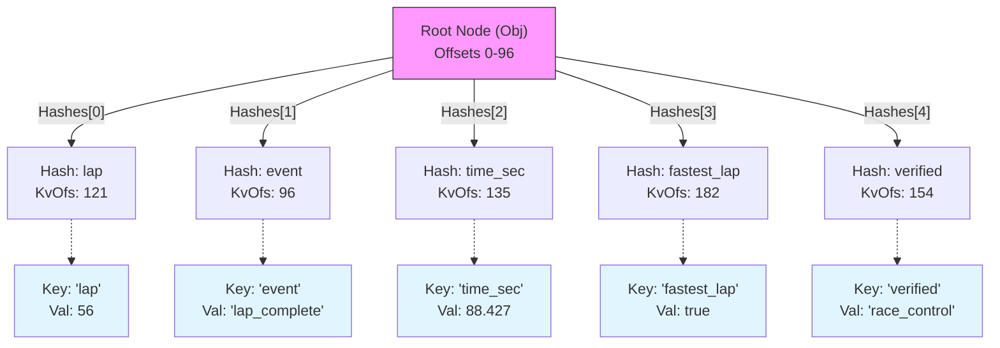

# Lite3 Binary Format Tutorial

This document provides a deep dive into the binary structure of a Lite3 message, using the output from the `01-building-messages` example.

## The Data

We are analyzing the binary representation of this JSON object:

```json
{
    "lap": 56,
    "event": "lap_complete",
    "time_sec": 88.427,
    "fastest_lap": true,
    "verified": "race_control"
}
```

## High-Level Structure

Lite3 buffers are **contiguous** and **append-only**. You can think of the buffer as being split into two logical regions:

1.  **The Root Node (Fixed Size)**: The "Header" of the structure. It occupies the first `N` bytes (96 in this case). It contains the B-tree metadata and an index of keys.
2.  **The Heap (Variable Size)**: All data entries (keys and values) are appended here, starting immediately after the Root Node.

```text
+-------------------------------------------------------+
|  Offset 0                 Offset 96                   |
|  [ ROOT NODE (B-Tree) ]   [ ENTRY 1 ] [ ENTRY 2 ] ... |
|  Contains offsets to ->   Data ...... Data ......     |
+-------------------------------------------------------+
```

Because it uses offsets (pointers relative to the start of the buffer), the format is **zero-copy**. You can read a value by hopping from the Root Node directly to the Entry offset.

## Hex Dump (Annotated)

Here is the raw binary output. The first column is the decimal offset.

```text
Offset | Data (Hex)                                      | ASCII (approx)
-------+-------------------------------------------------+---------------
000    | 06060000 428b880b 071c650f 2eb1c621 fb797a6b    | ....B... ..e. ..!. .zyk
020    | 334157d2 00000000 00000000 45010000 79000000    | 3AW..... ....E... y...
040    | 60000000 87000000 b6000000 9a000000 00000000    | `... .... .... .... ....
060    | 00000000 00000000 00000000 00000000 00000000    | .... .... .... .... ....
080    | 00000000 00000000 00000000 00000000 18657665    | .... .... .... .... .eve
100    | 6e740005 0d000000 6c61705f 636f6d70 6c657465    | nt...... lap_ comp lete
120    | 00106c61 70000238 00000000 00000024 74696d65    | ..la p..8 .... ...$ time
140    | 5f736563 000317d9 cef7531b 56402476 65726966    | _sec .... ..S. V@$v erif
160    | 69656400 050d0000 00726163 655f636f 6e74726f    | ied. .... .rac e_co ntro
180    | 6c003066 61737465 73745f6c 61700001 01          | l.0f aste st_l ap.. .
```

---

## Detailed Breakdown

### 1. Root Node (Offsets 0-96)

The root node is a **B-tree node**. In this specific implementation, it is configured to be **96 bytes** (aligned to 1.5 cache lines).

**Excerpt**:
```text
000 | 06060000 428b880b 071c650f 2eb1c621 fb797a6b
020 | 334157d2 00000000 00000000 45010000 79000000
040 | 60000000 87000000 b6000000 9a000000 00000000
060 | 00000000 00000000 00000000 00000000 00000000
080 | 00000000 00000000 00000000 00000000
```

#### Byte 0-4: GenType (`06 06 00 00`)
Value: `0x00000606` (Little Endian)

*   **Type (Low 8 bits)**: `0x06` -> `LITE3_TYPE_OBJECT`. This tells parsers the root is an Object (key-value pairs).
*   **Generation (High 24 bits)**: `0x000006` -> `6`.
    *   *What is this?* Since Lite3 allows reading data while pointers might be shifting (in complex scenarios) or simply to invalidate old iterators, a mutation counter is stored here. Every `set` operation increments this. We performed 6 updates to reach this state.
    *   *Note*: The `SPEC.md` mentions storing "N" (node size config) here, but this C implementation uses these bits solely for the Generation counter. The node size is implicit (compile-time constant).

#### Bytes 4-32: Hashes Array
An array of 7 `u32` integers. These are the hashes of the keys stored in this node.
*   `0x0b888b42` (Hash of "lap")
*   `0x0f651c07` (Hash of "event")
*   `0x21c6b12e` (Hash of "time_sec")
*   `0x6b7a79fb` (Hash of "fastest_lap")
*   `0xd2574133` (Hash of "verified")
*   `0x00000000` (Empty)
*   `0x00000000` (Empty)

#### Bytes 32-36: SizeKc (`45 01 00 00`)
Value: `0x00000145`

*   **KeyCount (Low 3 bits)**: `0x5` (5). The number of active keys in *this specific node*.
*   **Size (High 26 bits)**: `0x5`. The total number of items in the container.
    *   *Difference*: If the B-tree was deep (many nodes), `Size` would be the sum of all items in all nodes, whereas `KeyCount` is just the count for this 96-byte chunk. Here they are equal because everything fits in the root.

#### Bytes 36-64: KvOfs Array
An array of 7 `u32` offsets looking pointing to the Data Entries.
*   `0x79` (121) -> Points to "lap" entry.
*   `0x60` (96)  -> Points to "event" entry.
*   `0x87` (135) -> Points to "time_sec" entry.
*   `0xb6` (182) -> Points to "fastest_lap" entry.
*   `0x9a` (154) -> Points to "verified" entry.

#### Bytes 64-96: ChildOfs Array
An array of 8 `u32` offsets pointing to child nodes.
*   All `0`. This means this node is a **Leaf Node** (it has no children).

---

### 2. Data Entries (Offset 96+)

Following the root node, we find the actual data.

#### Entry 1: "event" (Offset 96)
**Excerpt**: `18 65 76 65 6e 74 00 05 0d 00 00 00 ...`

*   **Key Header (`18`)**: `0001 1000`
    *   Bits 0-1 (`00`): Tag Size = 1 byte.
    *   Bits 2+ (`0001 10`...): Key Length = 6.
*   **Key Bytes**: `65 76 65 6e 74 00` -> "event" + `\0`. (6 bytes).
*   **Type Tag (`05`)**: `LITE3_TYPE_STRING`.
*   **Payload (`0d 00 00 00` ...)**:
    *   Length: `13` (includes null terminator).
    *   Data: "lap_complete\0".

#### Entry 2: "lap" (Offset 121)
**Excerpt**: `10 6c 61 70 00 02 38 00 00 00 ...`

*   **Key Header (`10`)**: Key Length = 4.
*   **Key Bytes**: "lap\0".
*   **Type Tag (`02`)**: `LITE3_TYPE_I64`.
*   **Payload**: `38 00 00 00 00 00 00 00` -> `56` (64-bit integer, Little Endian).

#### Entry 3: "time_sec" (Offset 135)
**Excerpt**: `24 74 69 6d 65 5f 73 65 63 00 03 17 d9 ce f7 53 1b 56 40`

*   **Key**: "time_sec\0".
*   **Type Tag (`03`)**: `LITE3_TYPE_F64`.
*   **Payload**: `17 .. 40`. This is the IEEE 754 representation of `88.427`.

#### Entry 4: "verified" (Offset 154)
**Excerpt**: `... 05 0d 00 00 00 ...`

*   **Key**: "verified\0".
*   **Type Tag (`05`)**: String.
*   **Payload**: Length 13, "race_control\0".

#### Entry 5: "fastest_lap" (Offset 182)
**Excerpt**: `30 66 61 73 74 65 73 74 5f 6c 61 70 00 01 01`

*   **Key Header (`30`)**: Key Length = 12.
*   **Key Bytes**: "fastest_lap\0".
*   **Type Tag (`01`)**: `LITE3_TYPE_BOOL`.
*   **Payload**: `01` -> `true`. (Note: booleans naturally use 1 byte payload in this implementation).

---

## B-Tree Visualization

Since all 5 keys fit within the root node's capacity (7 keys), the tree is flat.



## Implementation FAQ

**Q: How does a parser know the node size is 96 bytes?**
A: **It doesn't.** In this specific C implementation, the node size is a **compile-time constant** (`LITE3_NODE_SIZE` in `lite3.h`). Both the writer and reader must currently agree on this constant. If a parser expects 100 bytes (as per the loose Spec) but reads this 96-byte buffer, it will read garbage data for offsets. The "N" parameter described in `SPEC.md` is not present in the header of this implementation.

**Q: Why are entries appended in seemingly random order?**
A: They are appended in **insertion order**.
1. `event` (offset 96) was inserted first.
2. `lap` (offset 121) was inserted second.
3. `time_sec` (offset 135) third.
The B-tree node (`KvOfs` array) maintains the **sorted order** (by Hash) to allow for `O(log n)` binary search lookups, but the physical data stays where it was written.
