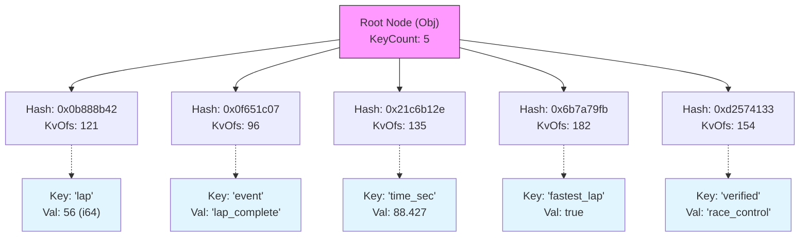

# Lite3 Binary Format Explained: `01-building-messages.c`

This document decomposes the binary output generated by the `01-building-messages` example to explain the Lite3 encoding scheme. 

The analysis is based on the finalized buffer state containing the following JSON object:

```json
{
    "lap": 56,
    "event": "lap_complete",
    "time_sec": 88.427,
    "fastest_lap": true,
    "verified": "race_control"
}
```

## Binary Overview

The Lite3 format is a flat, contiguous binary buffer containing a B-tree structure. The buffer grows append-only (mostly).

**Total Buffer Size**: 197 bytes
**Hex Dump**:
```text
06060000 428b880b 071c650f 2eb1c621 fb797a6b 334157d2 00000000 00000000 
45010000 79000000 60000000 87000000 b6000000 9a000000 00000000 00000000 
00000000 00000000 00000000 00000000 00000000 00000000 00000000 00000000 
18657665 6e740005 0d000000 6c61705f 636f6d70 6c657465 00106c61 70000238 
00000000 00000024 74696d65 5f736563 000317d9 cef7531b 56402476 65726966 
69656400 050d0000 00726163 655f636f 6e74726f 6c003066 61737465 73745f6c 
61700001 01
```

## Structure Breakdown

### 1. Root Node (Bytes 0-96)

The buffer always starts with the Root Node. In this implementation (Lite3 1.0.0 defaults), the node size is **96 bytes**.

| Offset | Hex Value | Type | Description |
| :--- | :--- | :--- | :--- |
| **0** | `06060000` | `u32` | **GenType**: `0x00000606`. <br> - `06` (LSB): `LITE3_TYPE_OBJECT` (6). <br> - `06`: Gen/N bits. |
| **4** | `428b880b` | `u32` | **Hash[0]**: `0x0b888b42` |
| **8** | `071c650f` | `u32` | **Hash[1]**: `0x0f651c07` |
| **12** | `2eb1c621` | `u32` | **Hash[2]**: `0x21c6b12e` |
| **16** | `fb797a6b` | `u32` | **Hash[3]**: `0x6b7a79fb` |
| **20** | `334157d2` | `u32` | **Hash[4]**: `0xd2574133` |
| **24** | `00..` | `u32` | **Hash[5]**: Empty |
| **28** | `00..` | `u32` | **Hash[6]**: Empty |
| **32** | `45010000` | `u32` | **SizeKc**: `0x00000145`. <br> - **KeyCount** (low 3 bits): `5` keys. <br> - **Size** (high 26 bits): `5` entries. |
| **36** | `79000000` | `u32` | **KvOfs[0]**: `121` (0x79) |
| **40** | `60000000` | `u32` | **KvOfs[1]**: `96` (0x60) |
| **44** | `87000000` | `u32` | **KvOfs[2]**: `135` (0x87) |
| **48** | `b6000000` | `u32` | **KvOfs[3]**: `182` (0xb6) |
| **52** | `9a000000` | `u32` | **KvOfs[4]**: `154` (0x9a) |
| **56-60** | `00..` | `u32` | **KvOfs[5-6]**: Empty |
| **64-95** | `00..` | `u32` | **ChildOfs[0-7]**: All `0`. This is a leaf node. |

### 2. Data Entries (Appended after Node)

Entries are appended to the buffer as they are inserted. The `KvOfs` array in the node points to these locations.

#### Entry: "event" (Offset 96 / 0x60)
*Referenced by Node KvOfs[1]*

| Offset | Hex | Interpretation |
| :--- | :--- | :--- |
| **96** | `18` | **KeyTag**: `0x18`. <br> - Bits 0-1: `00` -> TagLen = 1 byte. <br> - Bits 2+: `0x18 >> 2` = 6 -> KeyLen = 6 bytes. |
| **97** | `6576656e7400` | **Key**: "event\0" |
| **103** | `05` | **TypeTag**: `LITE3_TYPE_STRING` (5) |
| **104** | `0d000000` | **Length**: 13 bytes (string payload + null) |
| **108** | `6c6170...00` | **Value**: "lap_complete\0" |

#### Entry: "lap" (Offset 121 / 0x79)
*Referenced by Node KvOfs[0]*

| Offset | Hex | Interpretation |
| :--- | :--- | :--- |
| **121** | `10` | **KeyTag**: `0x10`. KeyLen = 4 ("lap\0"). |
| **122** | `6c617000` | **Key**: "lap\0" |
| **126** | `02` | **TypeTag**: `LITE3_TYPE_I64` (2) |
| **127** | `380000...` | **Value**: `56` (0x38 as i64) |

#### Entry: "time_sec" (Offset 135 / 0x87)
*Referenced by Node KvOfs[2]*

| Offset | Hex | Interpretation |
| :--- | :--- | :--- |
| **135** | `24` | **KeyTag**: KeyLen = 9. |
| **136** | `74696d..00` | **Key**: "time_sec\0" |
| **145** | `03` | **TypeTag**: `LITE3_TYPE_F64` (3) |
| **146** | `17d9ce..40` | **Value**: `88.427` (IEEE 754 double) |

#### Entry: "verified" (Offset 154 / 0x9a)
*Referenced by Node KvOfs[4]*

| Offset | Hex | Interpretation |
| :--- | :--- | :--- |
| **154** | `24` | **KeyTag**: KeyLen = 9. |
| **155** | `766572..00` | **Key**: "verified\0" |
| **164** | `05` | **TypeTag**: `LITE3_TYPE_STRING` (5) |
| **165** | `0d000000` | **Length**: 13 bytes |
| **169** | `726163..00` | **Value**: "race_control\0" |

#### Entry: "fastest_lap" (Offset 182 / 0xB6)
*Referenced by Node KvOfs[3]*

| Offset | Hex | Interpretation |
| :--- | :--- | :--- |
| **182** | `30` | **KeyTag**: KeyLen = 12. |
| **183** | `666173..00` | **Key**: "fastest_lap\0" |
| **195** | `01` | **TypeTag**: `LITE3_TYPE_BOOL` (1) |
| **196** | `01` | **Value**: `true` (1) |

## B-Tree Visualization



## Implementation Notes

- **Node Size**: This example uses the default `LITE3_NODE_SIZE` of **96 bytes**. This structure differs slightly from the `SPEC.md` format (which often assumes 100 bytes). This 96-byte layout fits exactly **7** keys (`MaxKeys = 7`) and aligns optimally to 1.5 cache lines (64 * 1.5 = 96).
- **Type Enums**: The implementation uses the following type mapping in `TypeTag` (byte after key):
    - `0x01`: Bool
    - `0x02`: Integer (i64)
    - `0x03`: Float (f64)
    - `0x05`: String
    - `0x06`: Object
