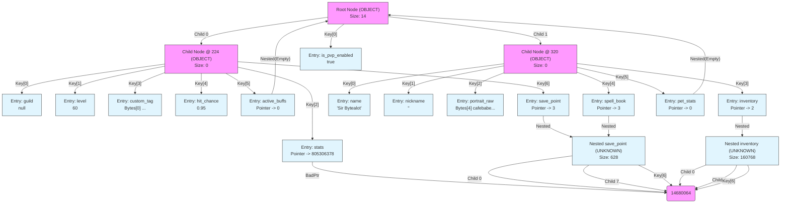

# Lite3 Binary Format: Linear Memory Walkthrough

This document analyzes the binary output of `08-comprehensive-features` by walking through the file **linearly from top to bottom**. This demonstrates how Lite3 is an **append-only** format: nodes and data entries are written to the heap in the order they are created or modified, resulting in an interleaved structure of B-Tree nodes and Value entries.

## 1. The Data (JSON)

We represent this RPG Character Profile:

```json
{
    "guild": null,
    "level": 60,
    "stats": {
        "agi": 13,
        "cha": 8,
        "dex": 14,
        "end": 15,
        "int": 10,
        "luc": 9,
        "per": 11,
        "str": 18,
        "vit": 16,
        "wis": 12
    },
    "custom_tag": "",
    "hit_chance": 0.95,
    "active_buffs": [],
    "save_point": [
        "Dark Forest",
        1734900000,
        {
            "x": 120,
            "y": 55
        }
    ],
    "is_pvp_enabled": true,
    "name": "Sir Bytealot",
    "nickname": "",
    "portrait_raw": "yv66vg==",
    "inventory": [
        {
            "dmg": 5,
            "name": "Rusty Sword",
            "type": "weapon"
        },
        {
            "heal": 50,
            "name": "Healing Potion",
            "type": "potion"
        }
    ],
    "spell_book": [
        101,
        205,
        303
    ],
    "pet_stats": {}
}
```

## 2. High-Level Layout

The file is a single contiguous buffer. Navigating the data (B-Tree traversal) involves jumping between these offsets.

```text
Offset 0   | Root Node (Fixed 96 bytes)
Offset 96  | Data Entry: "name"
Offset 120 | Data Entry: "level"
...        | ...
Offset 224 | Child Node A (Split Node)
Offset 320 | Child Node B (Split Node)
Offset 416 | Data Entry: "custom_tag"
...        | ...
```

## 3. Annotated Hex Dump

This is the **Raw hexadecimal view** of the file with **Decimal Offsets** (as requested) to make navigation easier for humans.

```text
0000 | 06 0e 00 00 80 76 70 6a 00 00 00 00 00 00 00 00 | .....vpj........
0016 | 00 00 00 00 00 00 00 00 00 00 00 00 00 00 00 00 | ................
0032 | 81 03 00 00 9d 00 00 00 00 00 00 00 00 00 00 00 | ................
0048 | 00 00 00 00 00 00 00 00 00 00 00 00 00 00 00 00 | ................
0064 | e0 00 00 00 40 01 00 00 00 00 00 00 00 00 00 00 | ....@...........
0080 | 00 00 00 00 00 00 00 00 00 00 00 00 00 00 00 00 | ................
0096 | 14 6e 61 6d 65 00 05 0d 00 00 00 53 69 72 20 42 | .name......Sir B
0112 | 79 74 65 61 6c 6f 74 00 18 6c 65 76 65 6c 00 02 | ytealot..level..
0128 | 3c 00 00 00 00 00 00 00 2c 68 69 74 5f 63 68 61 | <.......,hit_cha
0144 | 6e 63 65 00 03 66 66 66 66 66 66 ee 3f 3c 69 73 | nce..ffffff.?<is
0160 | 5f 70 76 70 5f 65 6e 61 62 6c 65 64 00 01 01 18 | _pvp_enabled....
0176 | 67 75 69 6c 64 00 00 34 70 6f 72 74 72 61 69 74 | guild..4portrait
0192 | 5f 72 61 77 00 04 04 00 00 00 ca fe ba be 24 6e | _raw..........$n
0208 | 69 63 6b 6e 61 6d 65 00 05 01 00 00 00 00 00 00 | ickname.........
0224 | 06 08 00 00 5a d1 88 0f 3d bc da 0f 14 4a 61 10 | ....Z...=....Ja.
0240 | 1b ec 70 10 2b ec 33 2e 96 cf 62 3d dd 71 69 54 | ..p.+.3...b=.qiT
0256 | 07 00 00 00 af 00 00 00 78 00 00 00 8d 02 00 00 | ........x.......
0272 | a0 01 00 00 88 00 00 00 b2 01 00 00 6c 06 00 00 | ............l...
0288 | 00 00 00 00 00 00 00 00 00 00 00 00 00 00 00 00 | ................
0304 | 00 00 00 00 00 00 00 00 00 00 00 00 00 00 00 00 | ................
0320 | 06 00 00 00 46 0c 9b 7c cb 9e 5c 81 03 ab de 88 | ....F..|..\.....
0336 | f3 6f 69 ac 8f ff 44 af fc dc e6 e5 00 00 00 00 | .oi...D.........
0352 | 06 00 00 00 60 00 00 00 ce 00 00 00 b7 00 00 00 | ....`...........
0368 | cd 04 00 00 44 04 00 00 21 02 00 00 00 00 00 00 | ....D...!.......
0384 | 00 00 00 00 00 00 00 00 00 00 00 00 00 00 00 00 | ................
0400 | 00 00 00 00 00 00 00 00 00 00 00 00 00 00 00 00 | ................
0416 | 2c 63 75 73 74 6f 6d 5f 74 61 67 00 04 00 00 00 | ,custom_tag.....
0432 | 00 00 34 61 63 74 69 76 65 5f 62 75 66 66 73 00 | ..4active_buffs.
0448 | 07 00 00 00 00 00 00 00 00 00 00 00 00 00 00 00 | ................
0464 | 00 00 00 00 00 00 00 00 00 00 00 00 00 00 00 00 | ................
0480 | 00 00 00 00 00 00 00 00 00 00 00 00 00 00 00 00 | ................
0496 | 00 00 00 00 00 00 00 00 00 00 00 00 00 00 00 00 | ................
0512 | 00 00 00 00 00 00 00 00 00 00 00 00 00 00 00 00 | ................
0528 | 00 00 00 00 00 00 00 00 00 00 00 00 00 00 00 00 | ................
0544 | 00 28 70 65 74 5f 73 74 61 74 73 00 06 00 00 00 | .(pet_stats.....
0560 | 00 00 00 00 00 00 00 00 00 00 00 00 00 00 00 00 | ................
0576 | 00 00 00 00 00 00 00 00 00 00 00 00 00 00 00 00 | ................
0592 | 00 00 00 00 00 00 00 00 00 00 00 00 00 00 00 00 | ................
0608 | 00 00 00 00 00 00 00 00 00 00 00 00 00 00 00 00 | ................
0624 | 00 00 00 00 00 00 00 00 00 00 00 00 00 00 00 00 | ................
0640 | 00 00 00 00 00 00 00 00 00 00 00 00 00 18 73 74 | ..............st
0656 | 61 74 73 00 06 0a 00 00 30 80 88 0b 00 00 00 00 | ats.....0.......
0672 | 00 00 00 00 00 00 00 00 00 00 00 00 00 00 00 00 | ................
0688 | 00 00 00 00 81 02 00 00 10 03 00 00 00 00 00 00 | ................
0704 | 00 00 00 00 00 00 00 00 00 00 00 00 00 00 00 00 | ................
0720 | 00 00 00 00 58 03 00 00 b8 03 00 00 00 00 00 00 | ....X...........
0736 | 00 00 00 00 00 00 00 00 00 00 00 00 00 00 00 00 | ................
0752 | 00 00 00 00 10 73 74 72 00 02 12 00 00 00 00 00 | .....str........
0768 | 00 00 10 64 65 78 00 02 0e 00 00 00 00 00 00 00 | ...dex..........
0784 | 10 69 6e 74 00 02 0a 00 00 00 00 00 00 00 10 76 | .int...........v
0800 | 69 74 00 02 10 00 00 00 00 00 00 00 10 77 69 73 | it...........wis
0816 | 00 02 0c 00 00 00 00 00 00 00 10 63 68 61 00 02 | ...........cha..
0832 | 08 00 00 00 00 00 00 00 10 61 67 69 00 02 0d 00 | .........agi....
0848 | 00 00 00 00 00 00 00 00 06 08 00 00 36 5d 88 0b | ............6]..
0864 | d1 65 88 0b c6 69 88 0b 1c 6f 88 0b 00 00 00 00 | .e...i...o......
0880 | 00 00 00 00 00 00 00 00 04 00 00 00 48 03 00 00 | ............H...
0896 | 3a 03 00 00 02 03 00 00 26 04 00 00 00 00 00 00 | :.......&.......
0912 | 00 00 00 00 00 00 00 00 00 00 00 00 00 00 00 00 | ................
0928 | 00 00 00 00 00 00 00 00 00 00 00 00 00 00 00 00 | ................
0944 | 00 00 00 00 00 00 00 00 06 00 00 00 c9 8d 88 0b | ................
0960 | cc 9c 88 0b 7e ab 88 0b d8 b6 88 0b 18 bb 88 0b | ....~...........
0976 | 00 00 00 00 00 00 00 00 05 00 00 00 18 04 00 00 | ................
0992 | 34 04 00 00 f4 02 00 00 1e 03 00 00 2c 03 00 00 | 4...........,...
1008 | 00 00 00 00 00 00 00 00 00 00 00 00 00 00 00 00 | ................
1024 | 00 00 00 00 00 00 00 00 00 00 00 00 00 00 00 00 | ................
1040 | 00 00 00 00 00 00 00 00 10 6c 75 63 00 02 09 00 | .........luc....
1056 | 00 00 00 00 00 00 10 65 6e 64 00 02 0f 00 00 00 | .......end......
1072 | 00 00 00 00 10 70 65 72 00 02 0b 00 00 00 00 00 | .....per........
1088 | 00 00 00 00 2c 73 70 65 6c 6c 5f 62 6f 6f 6b 00 | ....,spell_book.
1104 | 07 03 00 00 00 00 00 00 01 00 00 00 02 00 00 00 | ................
1120 | 00 00 00 00 00 00 00 00 00 00 00 00 00 00 00 00 | ................
1136 | c3 00 00 00 b0 04 00 00 b9 04 00 00 c2 04 00 00 | ................
1152 | 00 00 00 00 00 00 00 00 00 00 00 00 00 00 00 00 | ................
1168 | 00 00 00 00 00 00 00 00 00 00 00 00 00 00 00 00 | ................
1184 | 00 00 00 00 00 00 00 00 00 00 00 00 00 00 00 00 | ................
1200 | 02 65 00 00 00 00 00 00 00 02 cd 00 00 00 00 00 | .e..............
1216 | 00 00 02 2f 01 00 00 00 00 00 00 00 00 28 69 6e | .../.........(in
1232 | 76 65 6e 74 6f 72 79 00 07 02 00 00 00 00 00 00 | ventory.........
1248 | 01 00 00 00 00 00 00 00 00 00 00 00 00 00 00 00 | ................
1264 | 00 00 00 00 00 00 00 00 82 00 00 00 38 05 00 00 | ............8...
1280 | d0 05 00 00 00 00 00 00 00 00 00 00 00 00 00 00 | ................
1296 | 00 00 00 00 00 00 00 00 00 00 00 00 00 00 00 00 | ................
1312 | 00 00 00 00 00 00 00 00 00 00 00 00 00 00 00 00 | ................
1328 | 00 00 00 00 00 00 00 00 06 03 00 00 bd 6a 88 0b | .............j..
1344 | 46 0c 9b 7c 07 bd 9e 7c 00 00 00 00 00 00 00 00 | F..|...|........
1360 | 00 00 00 00 00 00 00 00 c3 00 00 00 c1 05 00 00 | ................
1376 | aa 05 00 00 98 05 00 00 00 00 00 00 00 00 00 00 | ................
1392 | 00 00 00 00 00 00 00 00 00 00 00 00 00 00 00 00 | ................
1408 | 00 00 00 00 00 00 00 00 00 00 00 00 00 00 00 00 | ................
1424 | 00 00 00 00 00 00 00 00 14 74 79 70 65 00 05 07 | .........type...
1440 | 00 00 00 77 65 61 70 6f 6e 00 14 6e 61 6d 65 00 | ...weapon..name.
1456 | 05 0c 00 00 00 52 75 73 74 79 20 53 77 6f 72 64 | .....Rusty Sword
1472 | 00 10 64 6d 67 00 02 05 00 00 00 00 00 00 00 00 | ..dmg...........
1488 | 06 03 00 00 7f d1 97 7c 46 0c 9b 7c 07 bd 9e 7c | .......|F..|...|
1504 | 00 00 00 00 00 00 00 00 00 00 00 00 00 00 00 00 | ................
1520 | c3 00 00 00 5c 06 00 00 42 06 00 00 30 06 00 00 | ....\...B...0...
1536 | 00 00 00 00 00 00 00 00 00 00 00 00 00 00 00 00 | ................
1552 | 00 00 00 00 00 00 00 00 00 00 00 00 00 00 00 00 | ................
1568 | 00 00 00 00 00 00 00 00 00 00 00 00 00 00 00 00 | ................
1584 | 14 74 79 70 65 00 05 07 00 00 00 70 6f 74 69 6f | .type......potio
1600 | 6e 00 14 6e 61 6d 65 00 05 0f 00 00 00 48 65 61 | n..name......Hea
1616 | 6c 69 6e 67 20 50 6f 74 69 6f 6e 00 14 68 65 61 | ling Potion..hea
1632 | 6c 00 02 32 00 00 00 00 00 00 00 00 2c 73 61 76 | l..2........,sav
1648 | 65 5f 70 6f 69 6e 74 00 07 03 00 00 00 00 00 00 | e_point.........
1664 | 01 00 00 00 02 00 00 00 00 00 00 00 00 00 00 00 | ................
1680 | 00 00 00 00 00 00 00 00 c3 00 00 00 d8 06 00 00 | ................
1696 | e9 06 00 00 f4 06 00 00 00 00 00 00 00 00 00 00 | ................
1712 | 00 00 00 00 00 00 00 00 00 00 00 00 00 00 00 00 | ................
1728 | 00 00 00 00 00 00 00 00 00 00 00 00 00 00 00 00 | ................
1744 | 00 00 00 00 00 00 00 00 05 0c 00 00 00 44 61 72 | .............Dar
1760 | 6b 20 46 6f 72 65 73 74 00 02 20 79 68 67 00 00 | k Forest.. yhg..
1776 | 00 00 00 00 06 02 00 00 1d b6 02 00 1e b6 02 00 | ................
1792 | 00 00 00 00 00 00 00 00 00 00 00 00 00 00 00 00 | ................
1808 | 00 00 00 00 82 00 00 00 54 07 00 00 60 07 00 00 | ........T...`...
1824 | 00 00 00 00 00 00 00 00 00 00 00 00 00 00 00 00 | ................
1840 | 00 00 00 00 00 00 00 00 00 00 00 00 00 00 00 00 | ................
1856 | 00 00 00 00 00 00 00 00 00 00 00 00 00 00 00 00 | ................
1872 | 00 00 00 00 08 78 00 02 78 00 00 00 00 00 00 00 | .....x..x.......
1888 | 08 79 00 02 37 00 00 00 00 00 00 00             | .y..7.......
```

## 4. Byte-by-Byte Breakdown

### Offset 0: Root Node
```text
0000 | 06 0e 00 00 80 76 70 6a 00 00 00 00 00 00 00 00 00 00 00 00 00 00 00 00 00 00 00 00 00 00 00 00 ...
```
**Generic Information**:
- **GenType**: `0x00000e06` (Type: OBJECT, Gen: 14)
- **Size**: Total 14, Local Keys 1
- **Hashes**: `6a707680 00000000 00000000 00000000 00000000 00000000 00000000`
- **Key Offsets**: [157]
- **Children**: [224, 320]

### Offset 2: Nested inventory
```text
0002 | 00 00 80 76 70 6a 00 00 00 00 00 00 00 00 00 00 00 00 00 00 00 00 00 00 00 00 00 00 00 00 81 03 ...
```
**Generic Information**:
- **GenType**: `0x76800000` (Type: UNKNOWN, Gen: 7766016)
- **Size**: Total 160768, Local Keys 0
- **Hashes**: `00006a70 00000000 00000000 00000000 00000000 00000000 03810000`
- **Key Offsets**: [14680064]
- **Children**: [20971520, 1846804480]

### Offset 3: Nested save_point
```text
0003 | 00 80 76 70 6a 00 00 00 00 00 00 00 00 00 00 00 00 00 00 00 00 00 00 00 00 00 00 00 00 81 03 00 ...
```
**Generic Information**:
- **GenType**: `0x70768000` (Type: UNKNOWN, Gen: 7370368)
- **Size**: Total 628, Local Keys 0
- **Hashes**: `0000006a 00000000 00000000 00000000 00000000 00000000 00038100`
- **Key Offsets**: [57344]
- **Children**: [81920, 1634604032]

### Offset 96: Entry "name"
```text
0096 | 14 6e 61 6d 65 00 05 0d 00 00 00 53 69 72 20 42 79 74 65 61 6c 6f 74 00
```
- **Key**: "name" (Len: 5)
- **Type**: STRING (5)
- **Value**: "Sir Bytealot"

### Offset 120: Entry "level"
```text
0120 | 18 6c 65 76 65 6c 00 02 3c 00 00 00 00 00 00 00
```
- **Key**: "level" (Len: 6)
- **Type**: I64 (2)
- **Value**: 60

### Offset 136: Entry "hit_chance"
```text
0136 | 2c 68 69 74 5f 63 68 61 6e 63 65 00 03 66 66 66 66 66 66 ee 3f
```
- **Key**: "hit_chance" (Len: 11)
- **Type**: F64 (3)
- **Value**: 0.95

### Offset 157: Entry "is_pvp_enabled"
```text
0157 | 3c 69 73 5f 70 76 70 5f 65 6e 61 62 6c 65 64 00 01 01
```
- **Key**: "is_pvp_enabled" (Len: 15)
- **Type**: BOOL (1)
- **Value**: true

### Offset 175: Entry "guild"
```text
0175 | 18 67 75 69 6c 64 00 00
```
- **Key**: "guild" (Len: 6)
- **Type**: NULL (0)
- **Value**: null

### Offset 183: Entry "portrait_raw"
```text
0183 | 34 70 6f 72 74 72 61 69 74 5f 72 61 77 00 04 04 00 00 00 ca fe ba be
```
- **Key**: "portrait_raw" (Len: 13)
- **Type**: BYTES (4)
- **Value**: Bytes[4] cafebabe...

### Offset 206: Entry "nickname"
```text
0206 | 24 6e 69 63 6b 6e 61 6d 65 00 05 01 00 00 00 00
```
- **Key**: "nickname" (Len: 9)
- **Type**: STRING (5)
- **Value**: ""

### Gap / Padding / Unreachable (Offset 222 - 224)
*   2 bytes of unaccounted data (likely padding or alignment).

### Offset 224: Child Node @ 224
```text
0224 | 06 08 00 00 5a d1 88 0f 3d bc da 0f 14 4a 61 10 1b ec 70 10 2b ec 33 2e 96 cf 62 3d dd 71 69 54 ...
```
**Generic Information**:
- **GenType**: `0x00000806` (Type: OBJECT, Gen: 8)
- **Size**: Total 0, Local Keys 7
- **Hashes**: `0f88d15a 0fdabc3d 10614a14 1070ec1b 2e33ec2b 3d62cf96 546971dd`
- **Key Offsets**: [175, 120, 653, 416, 136, 434, 1644]
- **Children**: []

### Offset 320: Child Node @ 320
```text
0320 | 06 00 00 00 46 0c 9b 7c cb 9e 5c 81 03 ab de 88 f3 6f 69 ac 8f ff 44 af fc dc e6 e5 00 00 00 00 ...
```
**Generic Information**:
- **GenType**: `0x00000006` (Type: OBJECT, Gen: 0)
- **Size**: Total 0, Local Keys 6
- **Hashes**: `7c9b0c46 815c9ecb 88deab03 ac696ff3 af44ff8f e5e6dcfc 00000000`
- **Key Offsets**: [96, 206, 183, 1229, 1092, 545]
- **Children**: []

### Offset 416: Entry "custom_tag"
```text
0416 | 2c 63 75 73 74 6f 6d 5f 74 61 67 00 04 00 00 00 00
```
- **Key**: "custom_tag" (Len: 11)
- **Type**: BYTES (4)
- **Value**: Bytes[0] ...

### Gap / Padding / Unreachable (Offset 433 - 434)
*   1 bytes of unaccounted data (likely padding or alignment).

### Offset 434: Entry "active_buffs"
```text
0434 | 34 61 63 74 69 76 65 5f 62 75 66 66 73 00 07 00 00 00 00
```
- **Key**: "active_buffs" (Len: 13)
- **Type**: ARRAY (7)
- **Value**: Pointer -> 0
- **Optimization**: Points to Root(0) as Empty Structure

### Gap / Padding / Unreachable (Offset 453 - 545)
*   92 bytes of unaccounted data (likely padding or alignment).

### Offset 545: Entry "pet_stats"
```text
0545 | 28 70 65 74 5f 73 74 61 74 73 00 06 00 00 00 00
```
- **Key**: "pet_stats" (Len: 10)
- **Type**: OBJECT (6)
- **Value**: Pointer -> 0
- **Optimization**: Points to Root(0) as Empty Structure

### Gap / Padding / Unreachable (Offset 561 - 653)
*   92 bytes of unaccounted data (likely padding or alignment).

### Offset 653: Entry "stats"
```text
0653 | 18 73 74 61 74 73 00 06 0a 00 00 30
```
- **Key**: "stats" (Len: 6)
- **Type**: OBJECT (6)
- **Value**: Pointer -> 805306378
- **Error**: Pointer 805306378 out of bounds

### Gap / Padding / Unreachable (Offset 665 - 1092)
*   427 bytes of unaccounted data (likely padding or alignment).

### Offset 1092: Entry "spell_book"
```text
1092 | 2c 73 70 65 6c 6c 5f 62 6f 6f 6b 00 07 03 00 00 00
```
- **Key**: "spell_book" (Len: 11)
- **Type**: ARRAY (7)
- **Value**: Pointer -> 3
- **Recursion**: parsing nested node at 3

### Gap / Padding / Unreachable (Offset 1109 - 1229)
*   120 bytes of unaccounted data (likely padding or alignment).

### Offset 1229: Entry "inventory"
```text
1229 | 28 69 6e 76 65 6e 74 6f 72 79 00 07 02 00 00 00
```
- **Key**: "inventory" (Len: 10)
- **Type**: ARRAY (7)
- **Value**: Pointer -> 2
- **Recursion**: parsing nested node at 2

### Gap / Padding / Unreachable (Offset 1245 - 1644)
*   399 bytes of unaccounted data (likely padding or alignment).

### Offset 1644: Entry "save_point"
```text
1644 | 2c 73 61 76 65 5f 70 6f 69 6e 74 00 07 03 00 00 00
```
- **Key**: "save_point" (Len: 11)
- **Type**: ARRAY (7)
- **Value**: Pointer -> 3
- **Recursion**: parsing nested node at 3

### Remaining Data (Offset 1661 - 1900)
*   Trailing bytes.

## 5. B-Tree Visualization

The following graph shows the logical structure derived from the binary data.



## 6. Summary of Key Concepts

1.  **Append-Only**: Data is never moved. New entries are written to the end of the buffer.
2.  **B-Tree Indexing**: 96-byte Nodes are scattered throughout the file. They form a tree structure to index the data entries.
3.  **Zero-Copy Nesting**: Nested objects are just pointers (offsets). You can "drill down" into a complex object by essentially re-rooting the parser at the new offset.
